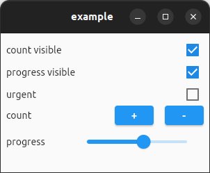

A wrapper around the Unity [LauncherAPI](https://wiki.ubuntu.com/Unity/LauncherAPI#Low_level_DBus_API:_com.canonical.Unity.LauncherEntry) that allows to show counter badges and progress bars on launcher icons in common linux desktop environments.

## Example application

Window:

Launcher icon:

